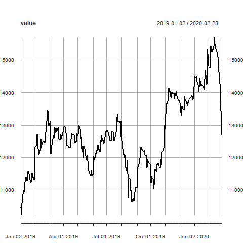

```{r echo=TRUE, message=FALSE, warning=FALSE}
library(quantmod)
library(moments)

getSymbols("INTC")
getSymbols("GM")
getSymbols("GE")

INTCc <- INTC$INTC.Close["20190101/20200301"]
GMc <- GM$GM.Close["20190101/20200301"]
GEc <- GE$GE.Close["20190101/20200301"]

INTCo <- INTC$INTC.Open["20190101/20200301"]
GMo <- GM$GM.Open["20190101/20200301"]
GEo <- GE$GE.Open["20190101/20200301"]

INTCr <- dailyReturn(INTC, type = "log")
GMr <- dailyReturn(GM, type = "log")
GEr <- dailyReturn(GE, type = "log")

```


```{r}
plot(cbind(INTCc,GMc,GEc), ylab = "Close Price", main = "INTC, GM, GE Price Changes")

```


```{r}
plot(cbind(INTCr,GMr,GEr), ylab = "Close Price", main = "INTC, GM, GE daily return rates")
```


```{r}
cat("Mean of INTC:", mean(INTCc))
cat("Standard Deviation of INTC:", sd(INTCc))
cat("Skewness of INTC:", skewness(INTCc))
cat("Kurtosis of INTC:", kurtosis(INTCc), "\n")

cat("Mean of GM:", mean(GMc))
cat("Standard Deviation of GM:", sd(GMc))
cat("Skewness of GM:", skewness(GMc))
cat("Kurtosis of GM:", kurtosis(GMc), "\n")

cat("Mean of GE:", mean(GEc))
cat("Standard Deviation of GE:", sd(GEc))
cat("Skewness of GE:", skewness(GEc))
cat("Kurtosis of GE:", kurtosis(GEc), "\n")


```


```{r}
hist(INTCc, freq = FALSE)
curve(dnorm(x,mean(INTCc),sd(INTCc)), add=TRUE,col = "red")

hist(GMc, freq = FALSE)
curve(dnorm(x,mean(GMc),sd(GMc)), add=TRUE,col = "red")

hist(GEc, freq = FALSE)
curve(dnorm(x,mean(GEc),sd(GEc)), add=TRUE,col = "red")

print("GE price histogram is closer to a normal distribution")

```


```{r}
INTCS <- as.integer(3000/coredata(INTCo[1]))
GMS <- as.integer(2000/coredata(GMo[1]))
GES <- as.integer(5000/coredata(GEo[1]))
value <- (INTCc * INTCS) + (GMc * GMS) + (GEc * GES)

png(file = "PortfolioValue.png")
plot(value)
dev.off()
cat("The final return rate is", 1 + (value[length(value)] - 10000) / 10000)
  
```

```{r pressure, echo=FALSE, fig.cap="PortfolioValue.png", out.width = '100%'}

```


